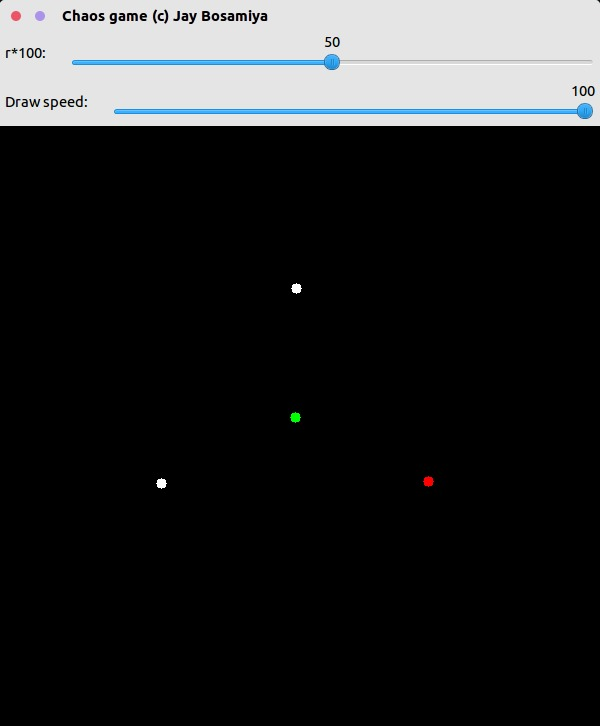
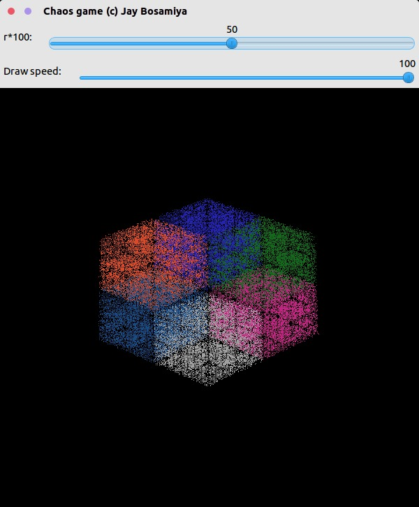
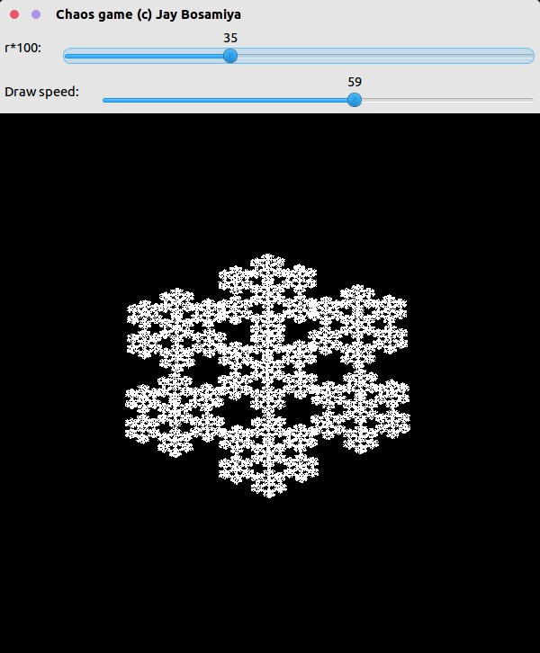

Chaos Game
==========

> Play the chaos game to create awesome fractal images

Screenshots
-----------








How it works
------------

The tool takes takes multiple points as input from the user. Then, it assigns the centroid of these points as the initial point. Then, it iterates moving towards a random point, moving in a ratio of `r` taken as input.

Usage
-----

```bash
./chaos-game
```

+ Left Click: Add new point
+ Keypress x: Delete latest point
+ Keypress f: Run the chaos game
+ Keypress q: Quit


Build process
-------------

```bash
mkdir build
cd build
cmake ..
make
```

Requirements
------------

+ OpenCV 2.x
+ CMake 2.8 or above

License
-------

This software is licensed under the [MIT License](http://jay.mit-license.org/2016)
